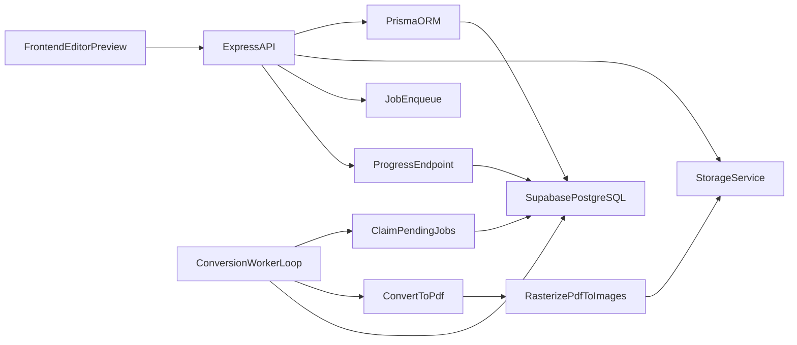

# Plan API Express TS (Supabase + Prisma + DB Queue)

## Objectif
Mettre en place une API robuste qui accepte `PDF/DOC/DOCX/XLS/XLSX/PPT/PPTX`, convertit en PDF canonique puis en images de pages, et expose un contrat simple pour `EditorPreview`.

## Choix techniques validés
- Backend: Express + TypeScript
- Base: PostgreSQL (Supabase)
- ORM: Prisma
- Orchestration V1: queue en base PostgreSQL (sans Redis/BullMQ)
- Formats V1: PDF + DOC/DOCX + XLS/XLSX + PPT/PPTX

## Architecture

## Structure projet proposée
- [api/src/app.ts](api/src/app.ts): init Express/middlewares/routes
- [api/src/server.ts](api/src/server.ts): bootstrap HTTP
- [api/src/config/env.ts](api/src/config/env.ts): validation env
- [api/src/modules/documents/document.controller.ts](api/src/modules/documents/document.controller.ts)
- [api/src/modules/documents/document.service.ts](api/src/modules/documents/document.service.ts)
- [api/src/modules/jobs/job.service.ts](api/src/modules/jobs/job.service.ts)
- [api/src/modules/jobs/worker.ts](api/src/modules/jobs/worker.ts)
- [api/src/modules/conversion/conversion.service.ts](api/src/modules/conversion/conversion.service.ts)
- [api/src/modules/storage/storage.service.ts](api/src/modules/storage/storage.service.ts)
- [api/src/modules/health/health.controller.ts](api/src/modules/health/health.controller.ts)
- [api/prisma/schema.prisma](api/prisma/schema.prisma)

## Modèle Prisma (V1)
- `Document`
  - `id`, `ownerId`, `status`, `originalName`, `mimeType`, `sizeBytes`
  - `sourcePath`, `pdfPath`, `pageCount`, `errorMessage`
  - `createdAt`, `updatedAt`
- `DocumentPage`
  - `id`, `documentId`, `pageIndex`, `imagePath`, `thumbPath`, `width`, `height`
- `ConversionJob`
  - `id`, `documentId`, `status`, `step`, `progress`
  - `attempt`, `maxAttempts`, `runAfter`, `lockedAt`, `lockedBy`
  - `lastError`, `createdAt`, `updatedAt`

Statuts `Document`: `uploaded`, `queued`, `normalizing`, `rasterizing`, `optimizing`, `ready`, `failed`.

Statuts `ConversionJob`: `pending`, `running`, `retry_wait`, `done`, `failed`.

## Contrat API REST
- `POST /v1/documents/upload` (multipart)
  - crée `Document` + `ConversionJob(pending)`
  - réponse: `{ documentId, status }`
- `GET /v1/documents/:id`
  - métadonnées document
- `GET /v1/documents/:id/progress`
  - `{ status, step, progress, errorMessage }`
- `GET /v1/documents/:id/pages`
  - `{ pageCount, pages: [{ index, url, width, height, thumbUrl }] }`
- `POST /v1/documents/:id/retry`
  - réinitialise job en `pending` si `failed`
- `DELETE /v1/documents/:id`
  - soft delete DB + purge fichiers async

## DB Queue (sans Redis) - mécanisme
- Worker loop toutes les 1-2 secondes:
  - claim atomique d’un job `pending` ou `retry_wait` (`runAfter <= now`)
  - verrouille via `lockedAt/lockedBy`
  - exécute pipeline
  - met à jour `progress/step/status`
- Retry:
  - `attempt++`
  - exponential backoff (`runAfter`)
  - au-delà `maxAttempts` -> `failed`
- Reaper:
  - jobs `running` bloqués (lock expiré) remis en `pending`

## Pipeline de conversion
1. Validation fichier (taille, mime, extension)
2. Stockage source
3. Normalisation vers PDF:
   - PDF: passthrough
   - DOC/DOCX/XLS/XLSX/PPT/PPTX: LibreOffice headless
4. Rasterisation PDF en images pages (JPG/WebP)
5. Génération miniatures
6. Persistance `DocumentPage`
7. Finalisation `Document.ready`

## Sécurité et exploitation
- Limites upload + MIME sniffing
- Rate limiting endpoints upload/retry
- Logs corrélés `documentId/jobId`
- Health endpoints: `/health` et `/ready`
- Nettoyage fichiers orphelins par job planifié

## Supabase + Prisma
- Env:
  - `DATABASE_URL` (pooled Supabase)
  - `DIRECT_URL` (direct Supabase pour migrations)
- Workflow:
  - `prisma migrate dev` (local)
  - `prisma migrate deploy` (prod)
  - `prisma generate` au build

## Intégration frontend
- `EditorPreview` ne dépend que de:
  - `GET /progress` pour polling
  - `GET /pages` quand status `ready`
- États UI: upload, conversion, prêt, erreur + bouton retry

## Livraison incrémentale
1. Foundation Express TS + Prisma + Supabase + env validation
2. Schéma Prisma + migration initiale
3. Endpoints upload/document/progress
4. Worker DB queue + claim atomique + retry
5. Conversion réelle (LibreOffice + rasterisation)
6. Endpoints pages + URLs storage
7. Hardening (rate limit, logs, cleanup, healthchecks)
